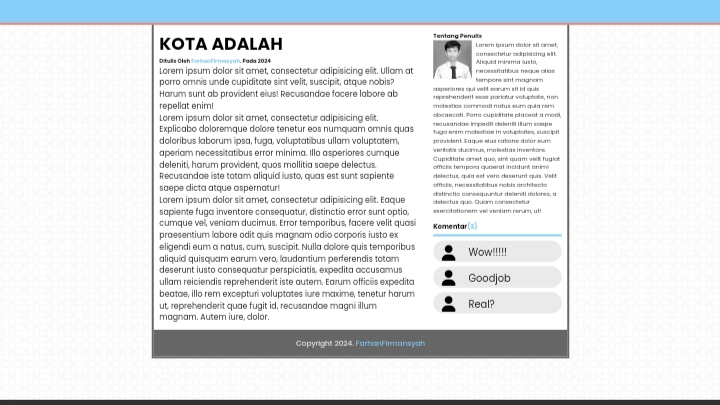

# webBeritaOld
I'm new to learning a little bit of css, so I made this as an exercise. This website contains a news layout.

  <h4>example:</h4>
  
   
  
   
  
   
  

# imageProfile
I'm learning to make my second website 

  
Example:

  
  <video width="320" height="240" controls>
    <source src="example/imageProfile/example.mp4" type="video/mp4">
  </video>

